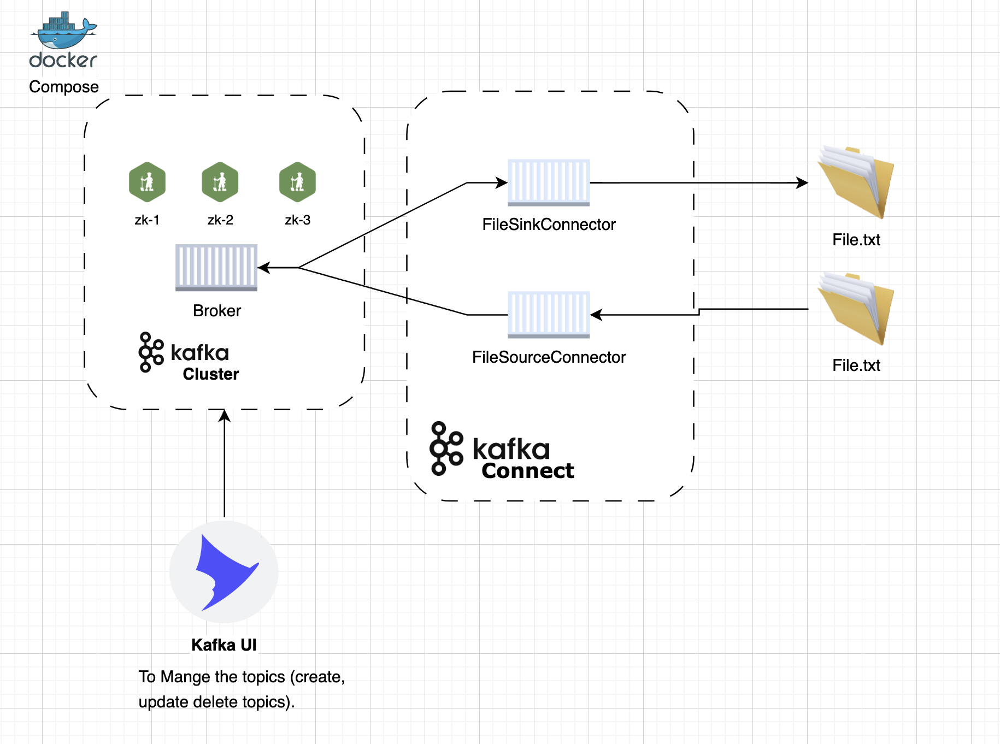
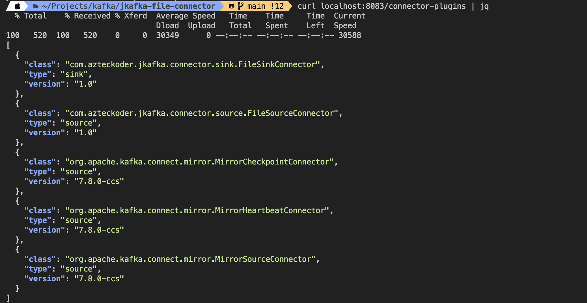
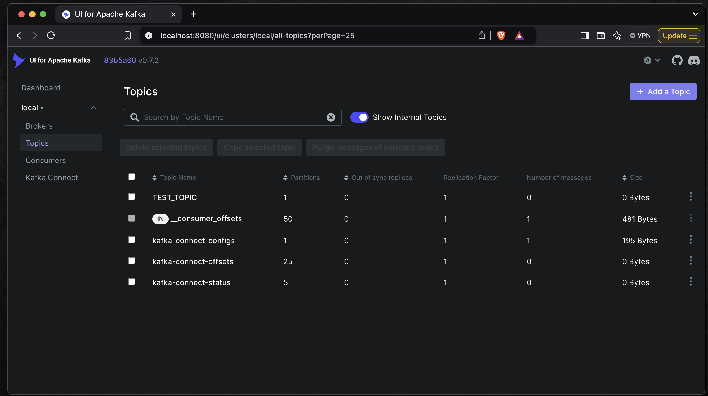
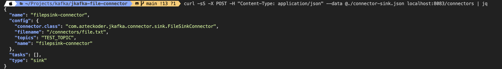
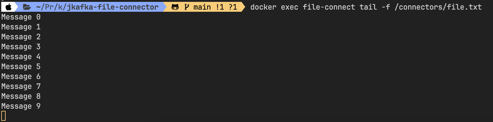
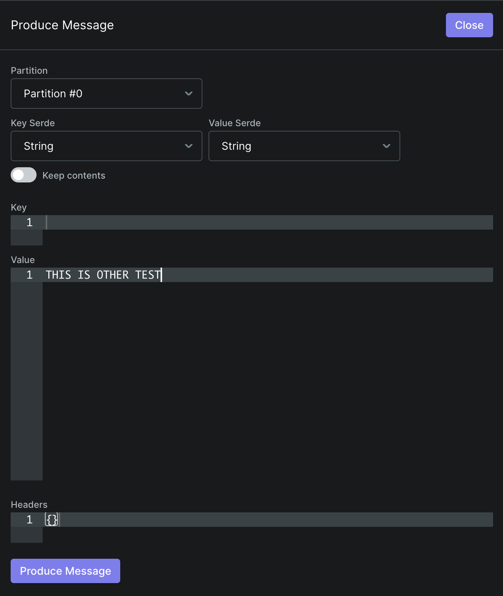

# Apache Kafka File Connector

This Example will show how to create a Kafka connector and test it with docker compose


## Architecture



## Components

| Component            | Description                                                                                       |
|----------------------|---------------------------------------------------------------------------------------------------|
| FileSinkConnector    | This Connector will read the topic and will append the file with the topic contents (Consumer)   |
| FileSourceConnector  | This Connector will read the file and push the contents to the Kafka Topic (Producer)            |
| MessageConsumer      | Consume the message from the topic and display the information in the console                    |
| MessageProducer      | It will generate messages and push each message to the topic.                                    |

## Compile (build the jar file)

```
./gradlew clean shadowJar
```

## Run docker composer

```
docker compose up -d
```

Verify all the containers are running by typing
```
docker ps --format "table {{.Names}}\t{{.Status}}"  
```

All containers should be in `Up` status
```
NAMES                               STATUS
file-connect                        Up About a minute (healthy)
kafka-ui                            Up About a minute
jkafka-file-connector-kafka-1       Up About a minute
jkafka-file-connector-zookeeper-1   Up About a minute
```


## Verify the Plugin connector is loaded 

```
curl localhost:8083/connector-plugins | jq  
```

If the Connector is properly loaded you will get the following output



As you can see we will able to see both: `FileSinkConnector` and `FileSouceConnector`, MirrorConnectors are **builtin** Apache Kafka connectors.


> [!NOTE]  
> If you are getting `curl: (56) Recv failure: Connection reset by peer` your kafka connector might not be ready yet, wait few more minutes and try again !!!


## Create the topic
In a browser, type: `localhost:8080`, and then go to the topics Section, and click on the top left button **"Add a Topic"**
Enter the following:

Topic Name: "TEST_TOPIC"
Number of Partitions: 1
Leave the other parametors as their defaults

Click on "Create Topic"





## Install the connector


* verify if the connector is installed:
```
 curl -sS localhost:8083/connectors | jq
```


* FileSinkConnector install

```
curl -sS -X POST -H "Content-Type: application/json" --data @./connector-sink.json localhost:8083/connectors | jq
```



* Runit again

```
 curl -sS localhost:8083/connectors | jq
```


## Test the Kafka Connector

When the connector is installed, automatically will start to consume the messages from the topic

In order to see what messages are being consumed, you can display the contents of the file located inside the kafka connector container in the /connectors folder as follows

```
docker exec file-connect tail -f /connectors/file.txt 
```
To produce test messages, open another shell window and run the `com.petco.jkafka.connector.MessageProducer.java` as follows:

```
./gradlew runProducer
```

You will be able to see the produced mesages in the file:



It is possible to use **kafka-ui** to produce more messages, open a browser and type `localhost:8080`, go to the Topics section and select "TEST_TOPIC"
click on **"Produce Message"** a popup will appear, 



Type a Value and click **Produce Message**
This is the result

