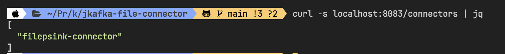

# jkafka-file-connector


## Compile (build the jar file)

```
     ./gradlew clean shadowJar
```


## Verify the Plugin connector is loaded 

```
 curl localhost:8083/connector-plugins | jq  
```

If the Connector is properly loaded you will get the following output


As you can see we will able to se both: *FileSinkConnector* and *FileSouceConnector*

## Install the connector


* verify if the connector is installed:

```
 curl -sS localhost:8083/connectors | jq
```


* FileSinkConnector install

```
curl -sS -X POST -H "Content-Type: application/json" --data @./connector-sink.json localhost:8083/connectors | jq
```


* Runit again

```
 curl -sS localhost:8083/connectors | jq
```



## Test the Kafka Connector

When the connector is installed, automatically will start to consume the messages from the topic

In order to verify what messages are being consumed, you can display the contents of the file located inside the kafka connector container in the /connectors folder as follows

```
docker exec file-connect tail -f /connectors/file.txt 
```
Then open another shell window and run the `com.petco.jkafka.connector.MessageProducer.java` as follows:

```
```

> [!NOTE]  
> If you are getting `curl: (56) Recv failure: Connection reset by peer` your kafka connector might not be ready yet, wait few more minutes